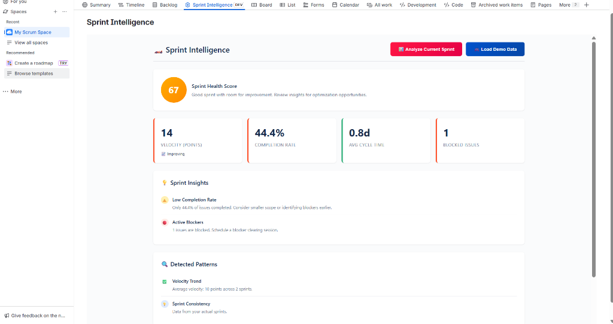
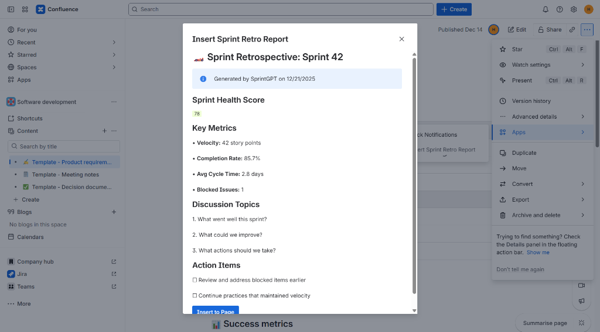

#  SprintGPT - AI Sprint Retrospective Engine

> Your AI-powered Sprint Engineer that analyzes sprint data like F1 telemetry. Built for Codegeist 2025: Atlassian Williams Racing Edition.

**🏆 Prize Categories:**
- **Apps for Software Teams** - Helps development teams operate like a pit crew with data-driven retrospectives
- **Best Rovo Apps** - Uses `rovo:agent` and `action` modules to enable natural language sprint analysis

---

## Screenshots

### Sprint Intelligence Dashboard


### Confluence Report Generator


---

## 1. What is SprintGPT?

SprintGPT is an **AI-powered sprint retrospective engine** built on Atlassian Forge that:

1. **Analyzes sprint metrics** with health scores and velocity tracking
2. **Detects patterns** across multiple sprints automatically
3. **Generates insights** for more effective retrospectives
4. **Creates reports** in Confluence (Experimental)
5. **Automates triggers** on sprint completion

---


## 2. Problem Statement

Sprint retrospectives often fail to deliver value. Teams struggle with:

| Problem | Impact |
|---------|--------|
| **Subjective discussions** | No data to back up observations |
| **Recurring issues** | Same problems resurface every sprint |
| **Forgotten action items** | Retro improvements never get implemented |
| **No historical view** | Can't track improvement over time |
| **Manual prep work** | Scrum masters spend hours gathering metrics |

**The Cost:**
- Average retro takes 1-2 hours with little actionable outcome
- Teams repeat the same mistakes sprint after sprint
- Velocity stagnates without data-driven insights

**SprintGPT solves this** by automatically analyzing your sprint data and providing AI-powered insights for more effective retrospectives.

---

## 3. Features & Implementation

| Feature | How It Works | File/Location |
|---------|--------------|---------------|
| **Sprint Dashboard** | Real-time metrics with health score (0-100) | `static/dashboard/src/App.js` |
| **Rovo AI Agent** | Natural language sprint analysis chat | `manifest.yml` (rovo:agent) |
| **Pattern Detection** | Identifies trends across sprints | `src/index.js` |
| **Confluence Reports** | Report generation (Experimental) | `insertReportHandler` |
| **Sprint Trigger** | Auto-analysis on sprint completion | `onSprintCompleteHandler` |

---

## 4. How It Works (User Flow)

```
+-------------------------------------------------------------+
|  1. INSTALL                                                 |
|  --> Add SprintGPT to your Jira project                     |
+-------------------------------------------------------------+
|  2. VIEW DASHBOARD                                          |
|  --> See health score, velocity, completion rate instantly  |
+-------------------------------------------------------------+
|  3. ANALYZE                                                 |
|  --> Click "Analyze Current Sprint" for deep insights       |
+-------------------------------------------------------------+
|  4. DETECT PATTERNS                                         |
|  --> AI identifies trends across your sprint history        |
+-------------------------------------------------------------+
|  5. GENERATE REPORT                                         |
|  --> Create Confluence retro report with one click          |
+-------------------------------------------------------------+
```

---

## 5. Sprint Health Algorithm

Our health score uses a weighted calculation:

### 5.1 Scoring Weights
| Factor | Weight | How It's Scored |
|--------|--------|-----------------|
| Completion Rate | 40% | % of issues done vs total |
| Blocked Issues | 25% | Penalty for blockers (0 = 100 pts) |
| Velocity vs Target | 20% | Story points completed |
| Cycle Time | 15% | Average days per issue |

### 5.2 Health Score Ranges
| Score | Rating | Color |
|-------|--------|-------|
| 80-100 | Excellent | 🟢 Green |
| 60-79 | Good | 🟡 Orange |
| 0-59 | Needs Attention | 🔴 Red |

**Formula:** `Health = (CompletionRate × 0.4) + (100 - BlockerPenalty) × 0.25 + (VelocityScore × 0.2) + (CycleTimeScore × 0.15)`

---

## 6. AI Capabilities (Rovo Agent)

| Action | Type | Purpose |
|--------|------|---------|
| `analyze-current-sprint` | GET | Full sprint metrics analysis |
| `compare-two-sprints` | GET | Side-by-side sprint comparison |
| `identify-patterns` | GET | Detect trends across history |
| `generate-retro-report` | CREATE | Generate Confluence report |
| `create-action-item` | CREATE | Create Jira issue from insight |

### Conversation Starters
- "Analyze our last sprint's performance"
- "Why did we miss our sprint goal?"
- "What are our recurring blockers?"
- "Generate retro talking points for today"
- "Compare this sprint to our best sprint"

---

## 7. Demo Data Support

**The app works 100% even without sprint data.** Every feature has a fallback:

| Scenario | Behavior |
|----------|----------|
| **Active sprint with issues** | Shows real metrics from Jira API |
| **Empty project** | Shows demo data for full UI preview |
| **Manual demo** | "Load Demo Data" button shows sample metrics |

> **Core features work fully with or without active sprints.**

---

## 8. Architecture

```
+-------------------------------------------------------------+
|                    ATLASSIAN FORGE                          |
+-------------------------------------------------------------+
|  UI Layer                                                   |
|  [Dashboard] [Rovo Agent] [Confluence Action] [Trigger]     |
+-------------------------------------------------------------+
|  Function Layer (Node.js)                                   |
|  +----------------+  +----------------+  +----------------+  |
|  | analyzeHandler |  | compareHandler |  | reportHandler  |  |
|  +----------------+  +----------------+  +----------------+  |
+-------------------------------------------------------------+
|  API Layer                                                  |
|  [Jira Agile API] [Forge Storage] [Confluence API]          |
+-------------------------------------------------------------+
```

---

## 9. Tech Stack

| Category | Technology |
|----------|------------|
| **Platform** | Atlassian Forge |
| **Runtime** | Node.js 22.x |
| **Frontend** | React 18, Custom UI |
| **AI** | Rovo Agent with custom actions |
| **Storage** | Forge Storage API |
| **APIs** | Jira Agile REST API |

---

## 10. Quick Start

### Option 1: One-Click Install (For Judges)

👉 **[Install SprintGPT](https://developer.atlassian.com/console/install/045c5e5c-6494-448c-a173-f08478bc6e01?signature=AYABePlb6mFSBcfFJ42BYVw%2FCWEAAAADAAdhd3Mta21zAEthcm46YXdzOmttczp1cy13ZXN0LTI6NzA5NTg3ODM1MjQzOmtleS83MDVlZDY3MC1mNTdjLTQxYjUtOWY5Yi1lM2YyZGNjMTQ2ZTcAuAECAQB4IOp8r3eKNYw8z2v%2FEq3%2FfvrZguoGsXpNSaDveR%2FF%2Fo0BiJCuH0In%2B8TbOLBqGB4u7wAAAH4wfAYJKoZIhvcNAQcGoG8wbQIBADBoBgkqhkiG9w0BBwEwHgYJYIZIAWUDBAEuMBEEDO2vblZrrz3sXXnx4gIBEIA74GuceZs1Ezi9RAAP17AQ3tQfyx50BL0Z3Ydl6lhaKca0pORs55cdD4HjreTRbk9zNvSBCbWygcOtULQAB2F3cy1rbXMAS2Fybjphd3M6a21zOmV1LXdlc3QtMTo3MDk1ODc4MzUyNDM6a2V5LzQ2MzBjZTZiLTAwYzMtNGRlMi04NzdiLTYyN2UyMDYwZTVjYwC4AQICAHijmwVTMt6Oj3F%2B0%2B0cVrojrS8yZ9ktpdfDxqPMSIkvHAEo8xkrV74ZKe7RAt%2FowrtxAAAAfjB8BgkqhkiG9w0BBwagbzBtAgEAMGgGCSqGSIb3DQEHATAeBglghkgBZQMEAS4wEQQMerPM2feesrStslhXAgEQgDv2UCZ6028USGmvqq%2F2B3PyMq0WSkJy7BkmXbRgP38CrBOeRGUniXHpVYLJ8W3zPXbES70KveM0SNEDUAAHYXdzLWttcwBLYXJuOmF3czprbXM6dXMtZWFzdC0xOjcwOTU4NzgzNTI0MzprZXkvNmMxMjBiYTAtNGNkNS00OTg1LWI4MmUtNDBhMDQ5NTJjYzU3ALgBAgIAeLKa7Dfn9BgbXaQmJGrkKztjV4vrreTkqr7wGwhqIYs5AVdbPkRglFq7VUJk2WSdi%2BoAAAB%2BMHwGCSqGSIb3DQEHBqBvMG0CAQAwaAYJKoZIhvcNAQcBMB4GCWCGSAFlAwQBLjARBAxNK7KyHYHD6kdxidcCARCAO%2BuHpl%2BtqLAyIQFfQCL5hyNeFe3WzUehGHDPx%2F0Sy5Vqu7io9NRgcdARwK5u2y7Bvc2%2F4GHVX%2F5tuJCdAgAAAAAMAAAQAAAAAAAAAAAAAAAAAK44nqz6gTukVqrFkD3m2aH%2F%2F%2F%2F%2FAAAAAQAAAAAAAAAAAAAAAQAAADLdrbD2T%2FRj9m7Gb2vQZuRw6IFi4ZFTjs2kb1hZUEzB1IX2tuZqsKRfULqNJQhMuqoywge5h0EaXV%2F3yUnhriu2b0M%3D&product=confluence&product=jira)**

1. Click the link above
2. Select your Atlassian site
3. Click "Get app"
4. Go to: **Jira Project → Apps → Sprint Intelligence**
5. To use Rovo: **Open Rovo Chat → Select "Sprint Engineer"**
6. To use Confluence: **Open any Page → Actions (...) → Insert Sprint Retro Report**

### Option 2: Clone & Deploy (For Developers)

```bash
# 1. Clone the repository
git clone https://github.com/himanshu-sugha/SprintGPT
cd SprintGPT

# 2. Install dependencies
npm install
cd static/dashboard && npm install && npm run build && cd ../..

# 3. Login to Forge
forge login

# 4. Register as your own app
forge register

# 5. Deploy
forge deploy

# 6. Install on your Jira site
forge install

# 7. Open the app
# Go to: **Jira Project → Apps → Sprint Intelligence**
# To use Rovo: **Open Rovo Chat → Select "Sprint Engineer"**
# To use Confluence: **Open any Page → Actions (...) → Insert Sprint Retro Report**
```

### Prerequisites
- Node.js 18+
- Atlassian Forge CLI (`npm install -g @forge/cli`)
- Atlassian Cloud account with Jira access
- Scrum project with at least one sprint

---

## 11. Project Structure

```
SprintGPT/
├── manifest.yml                 # Forge app configuration
├── package.json                 # Root dependencies
├── src/
│   └── index.js                 # All function handlers (700+ lines)
├── resources/
│   └── prompts/
│       └── sprint-engineer.md   # Rovo agent personality
└── static/
    └── dashboard/
        ├── package.json         # React dependencies
        └── src/
            ├── App.js           # Dashboard component
            └── index.css        # F1-themed styling
```

---

## 12. Author

**Himanshu Sugha**  
Email: himanshusugha@gmail.com  
GitHub: [@himanshu-sugha](https://github.com/himanshu-sugha)

---

## 13. License

MIT License - Built for Codegeist 2025

---

<p align="center">
  <b>SprintGPT - Analyze Sprints Like F1 Telemetry 🏎️</b>
</p>
